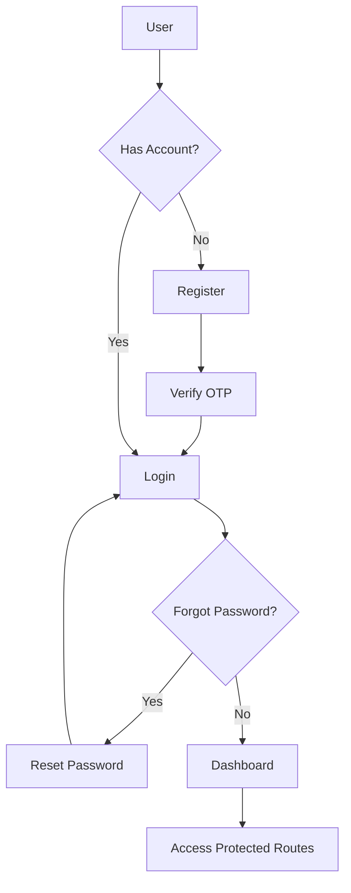

# 🛡️ Threat Intelligence Platform - SOC Dashboard

A modern, enterprise-grade Security Operations Center (SOC) dashboard built with **Next.js 16**, designed for real-time threat intelligence monitoring and analysis.


## 🎯 Features

### 🔐 **Authentication & Security**
- JWT-based authentication with secure httpOnly cookies
- Multi-factor authentication with OTP verification
- Password reset functionality with email-based OTP
- Protected routes with Next.js 16 proxy middleware
- Role-based access control (User/Admin)
- Session management with automatic logout on expiry

### 📊 **Dashboard Analytics**
- Real-time KPI monitoring with live updates
- Interactive charts and visualizations (Recharts)
- Severity distribution analysis (donut chart)
- IOC type breakdown (bar chart)
- Time-series threat trends with multi-line tracking
- Customizable time range selector (24h, 7d, 30d, 90d)
- Dynamic data refresh capabilities

### 🔍 **IOC Search & Analysis**
- Advanced filtering (type, severity, source, date range)
- Paginated results with sorting options
- Full-text search across all IOC fields
- Detailed IOC investigation page with metadata
- Related indicators correlation
- Confidence and severity scoring
- Source attribution and tracking
- Observation timeline visualization

### 📈 **Threat Intelligence Reports**
- Comprehensive threat summaries
- Source contribution analysis with pie charts
- Top critical threats identification
- Feed health monitoring dashboard
- Data quality metrics
- Multi-source IOC tracking

### 👤 **User Management**
- Profile management with editable fields
- Profile picture upload with preview
- Account information update (name, email, phone, DOB)
- Account deletion with two-step confirmation
- Image hosting integration with API server
- Local storage synchronization

### 🛠️ **Admin Panel** (Admin-only)
- Manual IOC ingestion trigger
- Feed status monitoring dashboard
- Real-time feed health indicators
- IOC count per feed source
- Last fetch and next fetch timestamps
- Feed enable/disable status tracking
- Comprehensive feed statistics

### 🎨 **Modern UI/UX**
- Dark-mode cybersecurity theme
- Responsive design (mobile-first approach)
- Smooth animations and transitions
- Gradient buttons with hover effects
- Glow effects and shadows
- Skeleton loaders for async content
- Professional SOC aesthetic
- Modern gradient text effects
- Interactive cards with hover states

## 🚀 Tech Stack

| Category | Technology |
|----------|-----------|
| **Framework** | Next.js 16 (App Router) |
| **Frontend** | React 19, TypeScript 5.7 |
| **Styling** | Tailwind CSS 3.4 |
| **Charts** | Recharts 2.15 |
| **Icons** | Lucide React |
| **HTTP Client** | Axios |
| **Date Handling** | date-fns |
| **State Management** | React Hooks |

## 📁 Project Structure

```
cnc-419-project-web/
├── app/
│   ├── (auth)/                    # Auth pages group
│   │   ├── login/                 # Login page
│   │   ├── register/              # Registration page
│   │   ├── verify-otp/            # OTP verification
│   │   └── reset-password/        # Password reset
│   ├── (dashboard)/               # Protected dashboard routes
│   │   ├── dashboard/             # Main dashboard with KPIs
│   │   ├── iocs/                  # IOC search & details
│   │   │   └── [id]/              # Dynamic IOC detail page
│   │   ├── reports/               # Analytics reports
│   │   ├── settings/              # User settings & profile
│   │   ├── admin/                 # Admin panel (admin-only)
│   │   └── threats/               # Threat intel (placeholder)
│   ├── globals.css                # Global styles & Tailwind
│   └── layout.tsx                 # Root layout with metadata
├── components/
│   ├── charts/                    # Recharts components
│   │   ├── SeverityDistributionChart.tsx
│   │   ├── TypeBreakdownChart.tsx
│   │   └── TimeSeriesChart.tsx
│   ├── layout/                    # Layout components
│   │   ├── Sidebar.tsx            # Navigation with role-based items
│   │   └── Header.tsx             # Top header with user info
│   └── ui/                        # Reusable UI components
│       ├── KPICard.tsx
│       ├── SeverityBadge.tsx
│       └── Skeleton.tsx
├── services/
│   ├── api.ts                     # Axios client with interceptors
│   ├── auth.ts                    # Auth service (login, register, etc.)
│   ├── iocs.ts                    # IOC/threat intel service
│   └── user.ts                    # User management service
├── types/
│   └── index.ts                   # TypeScript type definitions
├── utils/
│   └── helpers.ts                 # Utility functions
├── public/
│   └── favicon.svg                # App logo/favicon
├── proxy.ts                       # Route protection middleware
├── next.config.ts                 # Next.js config with image domains
├── tailwind.config.ts             # Tailwind custom theme
├── tsconfig.json                  # TypeScript configuration
├── .env                           # Environment variables
└── package.json
```

## 🔧 Installation & Setup

### Prerequisites
- Node.js 18+ and npm/yarn/pnpm
- Access to the DeltaTI API

### 1. Clone the repository
```bash
git clone <repository-url>
cd cnc-419-project-web
```

### 2. Install dependencies
```bash
npm install
# or
yarn install
# or
pnpm install
```

### 3. Configure environment variables
Create a `.env` file in the root directory:

```env
# API Configuration
NEXT_PUBLIC_BASE_URL=https://cnc419-api.codextech.org
NEXT_PUBLIC_API_KEY=your-api-key-here

# Application
NEXT_PUBLIC_APP_NAME="Threat Intelligence Platform"
NEXT_PUBLIC_APP_URL=http://localhost:3000
```

### 4. Run the development server
```bash
npm run dev
# or
yarn dev
# or
pnpm dev
```

Open [http://localhost:3000](http://localhost:3000) in your browser.

### 5. Build for production
```bash
npm run build
npm start
```

## 👤 Default Test Accounts

For testing purposes, you can register a new account or use existing credentials from the API.

**Note**: Admin features are only accessible to users with `role: "admin"` in the database.

## 🎨 Design System

### Color Palette

```css
/* Background */
--bg-primary: #0B0F1A
--bg-secondary: #0E1324
--card-bg: #12172A

/* Severity Colors */
--critical: #DC2626 (Red)
--high: #F97316 (Orange)
--medium: #FBBF24 (Yellow)
--low: #10B981 (Green)
--info: #06B6D4 (Cyan)

/* Accent Colors */
--accent-blue: #3B82F6
--accent-purple: #8B5CF6
--accent-cyan: #06B6D4
```

### Typography
- **Sans Serif**: Inter (system fallback)
- **Monospace**: JetBrains Mono (for IOC values, hashes)

### Components
- Cards with subtle borders and glow effects
- Animated hover states
- Responsive grid layouts
- Skeleton loaders for async data
- Color-coded severity badges

## 🔐 Authentication Flow



## 📡 API Integration

The dashboard integrates with the **CNC419 Threat Intelligence API**:

### Base URL
```
https://cnc419-api.codextech.org
```

### Authentication Strategy
- **Public Auth Endpoints**: Use `api-key` header
  - `/auth/login`
  - `/auth/register`
  - `/auth/verify-otp`
  - `/auth/resend-otp`
  - `/auth/reset-password`

- **Protected Endpoints**: Use `Bearer token` (JWT)
  - All `/threat-intel/*` endpoints
  - All `/user/*` endpoints
  - Dashboard and analytics endpoints

### Authentication Endpoints
- `POST /auth/register` - User registration (requires: email, password, firstName, lastName, phone, dateOfBirth, gender)
- `POST /auth/login` - User login (returns JWT token)
- `POST /auth/verify-otp` - OTP verification
- `POST /auth/resend-otp` - Resend OTP
- `POST /auth/reset-password` - Password reset with OTP
- `GET /auth/check` - Check authentication status
- `POST /auth/logout` - Logout user

### User Management Endpoints
- `POST /user/update` - Update user profile
- `POST /user/update-image` - Upload profile picture (multipart/form-data)
- `POST /user/delete` - Delete user account
- `POST /user/get` - Get user data by username

### Threat Intelligence Endpoints
- `POST /threat-intel/search` - Search IOCs with filters
- `POST /threat-intel/ioc` - Fetch specific IOC by ID
- `POST /threat-intel/report-summary` - Get threat summary report (with timeRange)
- `GET /threat-intel/fetch-status` - Get feed status (admin only)
- `POST /threat-intel/ingest` - Trigger IOC ingestion (admin only)

### Image Hosting
Profile images are served from:
```
https://cnc419-api.codextech.org/uploads/{filename}
```

## 🛠️ Key Features Explained

### 1. **KPI Cards**
Display critical metrics at a glance:
- Total IOCs detected across all feeds
- Critical threat count (severity: critical)
- High severity threats requiring attention
- Active threat feeds currently ingesting

### 2. **Interactive Charts**
- **Severity Distribution**: Donut chart showing threat severity breakdown with percentages
- **IOC Type Breakdown**: Bar chart of indicator types (IP, domain, hash, etc.)
- **Threat Trends**: Time-series line chart with multi-severity tracking and time range selector

### 3. **IOC Search**
Advanced filtering with:
- Full-text search across all fields
- Type filter (ipv4, domain, md5, sha256, url, hostname, yara, cve, email)
- Severity filter (critical, high, medium, low, info)
- Source filter
- Date range selection (from/to)
- Pagination with configurable results per page
- Real-time search results

### 4. **IOC Detail View**
Comprehensive threat analysis:
- Severity level and confidence scores
- Source information and attribution
- First seen and last seen timestamps
- Observation count tracking
- Tags and classification
- Raw threat intelligence data (JSON)
- Related indicators section (placeholder)

### 5. **Reports Dashboard**
Enterprise-grade reporting (placeholder structure ready):
- Executive summary with KPIs
- Severity distribution charts
- Source contributions analysis
- Top critical threats list
- Feed health monitoring
- Data quality metrics

### 6. **User Settings**
Complete profile management:
- **Profile Picture**: Upload with preview and image crop
- **Personal Information**: Edit name, email, phone, date of birth, gender
- **Account Actions**: Save changes, update profile
- **Danger Zone**: Delete account with two-step confirmation
- Real-time validation and error handling

### 7. **Admin Panel**
Exclusive admin-only features:
- **Manual Ingestion**: Trigger IOC data ingestion on-demand
- **Feed Status Table**: Monitor all threat intelligence feeds
  - Feed name and enabled status
  - Success/error status with color coding
  - IOC count per feed
  - Last fetch timestamp
  - Next scheduled fetch time
- **Statistics**: Total feeds, active feeds, total IOCs
- **Refresh**: Manual refresh of feed status

## 🔒 Security Best Practices

✅ **JWT tokens stored in httpOnly cookies** (7-day expiry)  
✅ **Protected routes with Next.js 16 proxy middleware**  
✅ **Token validation on each authenticated request**  
✅ **Automatic logout on 401 Unauthorized**  
✅ **Role-based access control** (User/Admin roles)  
✅ **Conditional authentication headers** (api-key vs Bearer token)  
✅ **Cookie settings**: `sameSite: 'lax'`, `path: '/'`  
✅ **XSS protection via React**  
✅ **Image upload validation** (multipart/form-data)  
✅ **Environment variable protection**  
✅ **Secure password reset with OTP**

## 📱 Responsive Design

The dashboard is fully responsive with breakpoints:
- **Mobile**: < 768px
- **Tablet**: 768px - 1024px
- **Desktop**: > 1024px

Key responsive features:
- Collapsible sidebar
- Stacked cards on mobile
- Horizontal scrolling tables
- Touch-friendly controls

## 🎯 Performance Optimizations

- ⚡ **Server Components by default** (Next.js 16 App Router)
- ⚡ **Client Components** only for interactive elements
- ⚡ **Lazy loading** of charts with dynamic imports
- ⚡ **Optimized images** with Next.js Image component
- ⚡ **Code splitting** per route automatically
- ⚡ **Skeleton loaders** for perceived performance
- ⚡ **Efficient API calls** with Axios interceptors
- ⚡ **Local storage caching** for user data
- ⚡ **Conditional rendering** based on user role
- ⚡ **Turbopack** for faster development builds

## 🧪 Testing

```bash
# Run linter
npm run lint

# Type checking
npx tsc --noEmit
```

## 🚢 Deployment

### Vercel (Recommended)
1. Push to GitHub
2. Import project in Vercel
3. Deploy automatically

### Docker
```dockerfile
FROM node:18-alpine
WORKDIR /app
COPY package*.json ./
RUN npm install
COPY . .
RUN npm run build
EXPOSE 3000
CMD ["npm", "start"]
```

## 📝 Environment Variables

Create a `.env` file in the root directory:

```env
# API Configuration
NEXT_PUBLIC_BASE_URL=https://cnc419-api.codextech.org
NEXT_PUBLIC_API_KEY=your-api-key-here

# Application
NEXT_PUBLIC_APP_NAME="Threat Intelligence Platform"
NEXT_PUBLIC_APP_URL=http://localhost:3000
```

**Note**: All `NEXT_PUBLIC_*` variables are exposed to the browser.

## 🔑 Key Technologies & Libraries

| Package | Version | Purpose |
|---------|---------|---------|
| next | 16.1.1 | React framework with App Router |
| react | 19.0.0 | UI library |
| typescript | 5.7.3 | Type safety |
| tailwindcss | 3.4.17 | Utility-first CSS |
| axios | 1.7.9 | HTTP client with interceptors |
| recharts | 2.15.0 | Chart library |
| lucide-react | 0.468.0 | Icon library |
| js-cookie | 3.0.5 | Cookie management |
| date-fns | 4.1.0 | Date utilities |

## 🎨 UI Components

### Custom Components
- **KPICard**: Display key metrics with icons
- **SeverityBadge**: Color-coded severity indicators
- **Skeleton**: Loading placeholders
- **Charts**: Recharts wrappers for data visualization
- **Sidebar**: Navigation with role-based items
- **Header**: Top bar with user profile

### Styling Approach
- **Tailwind CSS** for utility classes
- **CSS Variables** for theme colors
- **Gradient effects** on buttons and text
- **Hover animations** with transitions
- **Responsive breakpoints** for all screen sizes

## 🤝 Contributing

1. Fork the repository
2. Create a feature branch (`git checkout -b feature/amazing-feature`)
3. Commit your changes (`git commit -m 'Add amazing feature'`)
4. Push to the branch (`git push origin feature/amazing-feature`)
5. Open a Pull Request

## 📄 License

This project is proprietary and confidential.

## 🙏 Acknowledgments

- **API Backend**: CNC419 Threat Intelligence API
- **Design Inspiration**: Splunk, Elastic SIEM, CrowdStrike Falcon
- **Icons**: Lucide React
- **Charts**: Recharts
- **Framework**: Next.js by Vercel
- **Styling**: Tailwind CSS

## 📊 Project Stats

- **Total Pages**: 11 (4 auth + 7 dashboard)
- **Components**: 15+ reusable components
- **API Endpoints**: 15+ integrated endpoints
- **TypeScript Coverage**: 100%
- **Build Size**: Optimized for production
- **Dependencies**: 399 packages (0 vulnerabilities)

## 🚀 Recent Updates

- ✅ Added time range selector to dashboard (24h, 7d, 30d, 90d)
- ✅ Implemented user profile management with image upload
- ✅ Created admin panel for feed management
- ✅ Added role-based navigation and access control
- ✅ Enhanced UI with modern gradient buttons
- ✅ Fixed API authentication strategy (api-key vs Bearer)
- ✅ Integrated SVG logo/favicon throughout app
- ✅ Updated Next.js config for remote image hosting

---

**Built with ❤️ for Security Operations Centers**

For questions or support, please contact the development team.
